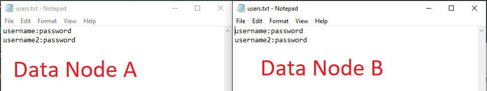
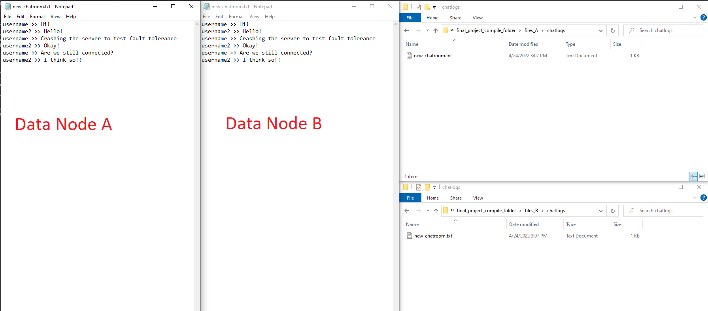

# Local Testing

This file shows significant log statements that show how our application handles key
algorithms and behavior for our application, how our application handles errors or invalid
input, and how the client can interact with our application. This testing was conducted
locally for simplicity.

All tests were conducted on the minimum number of components required to showcase
the important aspects of our chatroom application. As such, these tests are run on
two chat servers, two data servers, one central server, and two clients.

All images are available for further inspection under the `images` folder associated
with this submission.

Our demo video associated with this submission will show more clearly how a user can 
interact with our application.

## Normal Operation

This screenshot shows what the application looks like when run from a single machine:

## Four Main Algorithms

### Cristian's Algorithm

Cristian's algorithm may be verified in the `CristiansLogger.java` file included in this
submission. This file may be found in the `util` package.

**Central Server**

**Data Server**

**Chat Server**

### Pub/Sub

Our Pub/Sub algorithm may be verified in the `ConnectChatroom.java`, `ChatroomUserOperations.java`,
and `Chatroom.java` files included in this submission. These files may be found in the `chatserver` package.

These log files may be found in the chat server logs produced during execution of the program.

**Publishing**

**Subscribing**

**Unsubscribing**

### 2 Phase Commit

**Create User**

**Create Chatroom**

**Delete Chatroom**

**Log Message**

**Under Contention**

While it is hard to force conflicts during 2 phase commit from a single machine, we have a test file
that showcases how our server handles conflicting keys on transactions during 2 phase commit, and how
it handles issuing doAbort commands. Thus, for multiple users attempting to create the same username
at the same time, we can see how our system issues doAbort requests to participants when there is a 
collision between client requests:

### Data Replication

Each data server in the system will store data in a folder `files_<id>` where `<id>` is the
unique ID used to start the data server. The following images are pulled from `files_A`
and `files_B` for data nodes `A` and `B` respectively.

**files_`<id>`**

**users.txt**

Note: Our system stores user data in the format `<username>:<password>` for each user on a new line.

**chatroom.txt**

Note: Our system stores chatroom data in the format `<chatroom name>:<username>` for each chatroom
on a new line.

**chatLogs directory**

Note: Our system stores chatroom messages in the `.txt` file for that chatroom with the same name as the
chatroom. For example, for a chatroom called `new_chatroom`, the corresponding text file will be
`new_chatroom.txt`. All messages logged appear here exactly as they appear to the clients in their
Java Swing windows.

## Re-Establishing a Connection

Re-establishing a connection takes advantage of our load balancing behavior, which
can be examined in the `innerCreateChatroom` method in the `CentralUserOperations.java` file
under the `centralserver` package in this submission.

## Client Interface

### Log in

**Success**

**Non-Existent User**

**Bad Password**

### Create User

**Success**

**Invalid Username**

**Invalid Password**

**Duplicate Username**

### Joining Chatroom

**Success**

**Invalid Chatroom**

### Getting Available Chatrooms

### Creating a Chatroom

**Success**

**Duplicate Chatroom**

**Bad Chatroom Name**

### Deleting a Chatroom

**Success**

**Non-Existent Chatroom**

**User does not own Chatroom**

### Exit

**Prompt 1**

**Prompt 2**

### Invalid Option

**Prompt 1**

**Prompt 2**

## Invalid Server arguments

### Central Server

### Chat Server

Note: The logger used for the Chat Server requires the ID for the server be parsed
to generate the log file. Thus, while parsing command line arguments, if an error
occurs, the chat server will instead print the error to the command line.

### Data Server

Note: The logger used for the Data Server requires the ID for the server be parsed
to generate the log file. Thus, while parsing command line arguments, if an error
occurs, the chat server will instead print the error to the command line.

### Client

