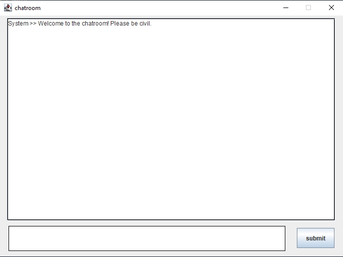
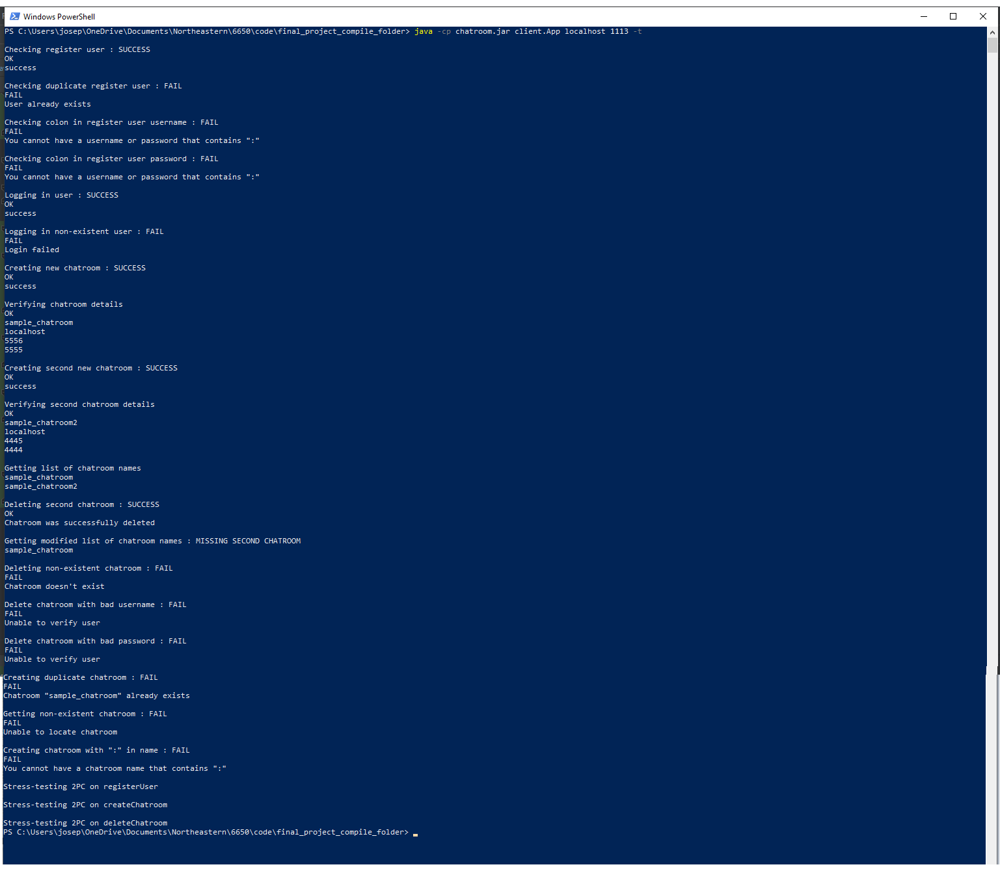

# Chatroom Final Project
Final project for CS6650: A Chatroom Application

Joseph Burns, Daniel Levin, Hephzibah Saidu, Rodolph Mesadieu

Our final project demo video can be found at the following link:

https://www.youtube.com/watch?v=x2_b2roWxU4

## Starting the Application

To start our application, the following components should be started in the order provided. Once the application
is running, our system is resilient to any data node or chat node failure so long as at least one of each node exists, 
and new chat nodes may be added to the system at any time.

### Central Server

First, our project requires that the central server be running before all other components in the system. To start
the central server, open a terminal and navigate to the folder that contains our `chatroom.jar` file. Then, in
this directory, run the following command:

```
java -cp chatroom.jar centralserver.App <register port> <chatroom port> <user port> <coordinator port>
```

- `<register port>` : the port that data and server nodes may register with the central server on
- `<chatroom port>` : the port that the central server listens for log requests from chatroom servers
- `<user port>` : the port that the central server listens for user requests on
- `<coordinator port>` : the port that the central server listens for Coordinator operation requests on from participant data servers
 during 2PC

For example, a user may start the central server using the following command:

```
java -cp chatroom.jar centralserver.App 1111 1112 1113 1114
```

Once the central server is ready, it will print a ready message to the command line indicating it is ready
to receive requests from chat nodes, data nodes, and users. Once this ready message appears, move on to
the next step.

### Chat Server

Second, our project recommends starting the chat servers. To start the chat servers, open one terminal for each server. 
Then, in each terminal, navigate to the directory that contains our `chatroom.jar` file. 
Then, in this directory, run the following command in each terminal:

```
java -cp chatroom.jar chatserver.App <id> <central hostname> <register port> <hostname> <tcp port> <rmi port> <operations port>
```

- `<id>` : the unique ID for this chat server
- `<central hostname>` :  the host address of the central server
- `<register port>` : the port that the central server is listening for registration requests on
- `<hostname>` : the hostname of the machine hosting the current chat server
- `<tcp port>` : the port that the chat server listens for client TCP connections on
- `<rmi port>` : the port that the chat server listens for client requests on via the RMI interface
- `<operations port>` : the port that the chat server listens for central server requests on

Per our project proposal, we recommend starting four chat servers. Thus, for four terminals, each one dedicated
to a single chat server, run the following commands as an example:

```
java -cp chatroom.jar chatserver.App A localhost 1111 localhost 4444 4445 4446
java -cp chatroom.jar chatserver.App B localhost 1111 localhost 5555 5556 5557
java -cp chatroom.jar chatserver.App C localhost 1111 localhost 6666 6667 6668
java -cp chatroom.jar chatserver.App D localhost 1111 localhost 7777 7778 7779
```

Once a chat server is ready, it will print a ready message to the terminal where it was started. Once this
ready message appears, move on to the next step.

Note: The unique ID for each chat server must only be unique among the chat servers. Thus, there may be both
a Data Node A and a Chat Server A, but because they are fundamentally different types of servers, our application
is able to delineate one from the other.

Note: The `<register port>` value here should match the `<register port>` value used to start the central
server for all chat servers in the system.

Note: If starting this application on a single machine, ensure that the `<tcp port>`, `<rmi port>` and
`<operations port>` values are all unique to each server.

### Data Server

Third, our project recommends starting the data servers. To start the data servers, open one terminal for
each server. Then, in each terminal, navigate to the directory that contains our `chatroom.jar` file.
Then, in this directory, run the following command in each terminal:

```
java -cp chatroom.jar dataserver.App <id> <central hostname> <register port> <hostname> <operations port> <participant port>
```

- `<id>` : the unique ID for this data server
- `<central hostname>` : the host address for the machine supporting the central server
- `<register port>` : the port that the central server is listening for registration requests on
- `<hostname>` : the hostname of the machine hosting the current data server
- `<operations port>` : the port that the data server accepts central server requests on 
- `<participant port>` : the port that the data server listens for 2PC Participant operation requests from the central server on

Per our project proposal, we recommend starting two data servers. Thus, for two terminals, each one dedicated to a single
data server, run the following commands as an example:

```
java -cp chatroom.jar dataserver.App A localhost 1111 localhost 2222 2223
java -cp chatroom.jar dataserver.App B localhost 1111 localhost 3333 3334
```

Once a data server is ready, it will print a ready message to the terminal where it was started. Once this ready
message appears, move on to the next step.

Note: The unique ID for each chat server must only be unique among the data servers. Thus, there may be both
a Data Node A and a Chat Server A, but because they are fundamentally different types of servers, our application
is able to delineate one from the other.

Note: The `<register port>` value here should match the `<register port>` value used to start the central
server for all data servers in the system.

Note: If starting this application on a single machine, ensure that the `<participant port>` and
`<operations port>` values are all unique to each server.

### Client

Once all the servers are up and running, clients may be added to the system. To start a client,
open a terminal and navigate to a directory that contains the `chatroom.jar` file. Then, run
the following command:

```
java -cp chatroom.jar client.App <central hostname> <central port>
```

- `<central hostname>` : the host address for the machine supporting the central server
- `<central port>` : the port that the central server is accepting client connections on

For example, to start the client on a local machine, run the following command:

```
java -cp chatroom.jar client.App localhost 1113
```


Note: The `<central port>` here should match the `<user port>` used to start the central
server.

Note: We assume that each client will be run from different machines, or at least different
directories on the same machine. Thus, each client should be started in a unique location. Multiple
clients run from the same directory on the same machine will attempt to log to the same file, which
may cause some confusion when verifying operations for multiple clients using their log files. 

## Interacting with the Application

Once the application is running, a client will receive two sets of prompts. The first prompt
will ask them to log in or create a user, and the second prompt will ask them to either join,
create, delete, or list chatrooms.

All usernames and chatroom names must be unique in the system. All chatroom names, usernames, and passwords
are not allowed to contain the character `:`. If there is any error with a request by the client, the
application will print an error message to the screen detailing what went wrong with the request. If
a user selects an invalid option for either prompt, the system will indicate that an invalid option has been selected,
and continue to prompt the user for input.

### Log in / Create User prompt

For the first set of prompts the user may enter `1` to log into the application, `2` to create
a username and password, or `exit` to leave the application. For either options `1` or `2`, the client
will be prompted for a username and password. If logging in with option `1`, the client should provide
a username and password that they have previously created with the application. If creating a user
with option `2`, the client should provide a unique username and a password they can use to log back
into the account in subsequent sessions.

The prompt will appear as follows:


### Join/Leave/Create/Get Chatroom prompt

For the second set of prompts, the user may enter `1` to join a chatroom, `2` to get a list of
available chatrooms, `3` to create a new chatroom, `4` to delete a chatroom that the user themselves
created, `5` to log out of their account, or `exit` to leave the application. For option `1`, the user 
should provide the name of a chatroom that already exists in the system. For option `2`, the user will 
receive a list of available chatrooms printed to the terminal screen. For option `3`, the user should
provide a unique chatroom name to create a new chatroom. For option `4`, the user should provide the
name of a chatroom that they created.

The prompt will appear as follows:


#### Interacting with the Chatroom Window

After a user joins a chatroom, they a new window will appear that allows them to interact
with a chatroom. The window will appear as follows:



Messages received from the central server will appear in the main part of the window, the user may enter 
their own messages in the text entry field in the bottom of the screen, and they can submit their messages
to the chatroom via the `submit` button in the bottom right corner of the window.

To leave a chatroom, the user simply has to click the `X` button in the top right corner of the
chat window. This will automatically cause them to leave the chatroom.

## Terminating the application

The client may exit the application at any time by typing the `exit` command into the main
prompt. They may also use `ctrl-c` to terminate their application, though this is not
recommended.

To close the central server, chat servers, and data servers, simply press `ctrl-c` in each server's
respective window. However, once the Central Server has been terminated, the application will
no longer be able to operate since it connects the various components of the application.


## Verifying logs

Significant logging statements used to verify the operation of our four key algorithms as
defined in the final project report associated with this assignment (as well as our load
balancing), may be seen in our `LocalTesting.md` file included in our submission.

### Central Server

Since our system is designed to work with a single central server, the central server logs
may be found in the `CentralServerLog.txt` file in the same directory from which the
central server was launched.

### Chat Server

Each chat server log will be available in the same directory from which the chat server
was launched. It will appear as `ChatNode<id>Log.txt`, where `<id>` is the unique ID
provided to the chat server when it was launched.

### Data Server

Each data server will be available in the same directory from which the data server
was launched. It will appear as `DataNode<id>.txt`, where `<id>` is the unique ID
provided to the data server when it was launched.

Additionally, each data server in the system will store its data in a folder `files_<id>`
where `<id>` is the unique ID used to start the data server. The `users.txt`, `chatrooms.txt`,
and `chatlogs` files and directories for each data server may be found in its
respective `files_<id>` directory.

### Client

Each client will write to the `ClientLog.txt` file available in the same directory
from which the client was launched.

## Local Testing

While our application may be manually tested using the steps described above for operating the
application on a local machine, we have also included a basic test file that shows how many
of our operations and algorithms work. To run this test file, set the servers up as described
in the **Starting the Application** heading, and run the following command from a client
terminal:

```
java -cp chatroom.jar client.App <central hostname> <central port> -t
```

The `-t` flag indicates that the test file should be run, and the client will run several
operations where it contacts the central server, and then promptly exit. The result of 
the tests will be printed to the console as follows:



Additionally, logs at the central server, data nodes, and chat nodes, as well as the storage files
and directories for each data node, will showcase how our application handles good user input,
bad user input, 2 phase commit on creating a user, creating a chatroom, and deleting a chatroom.


